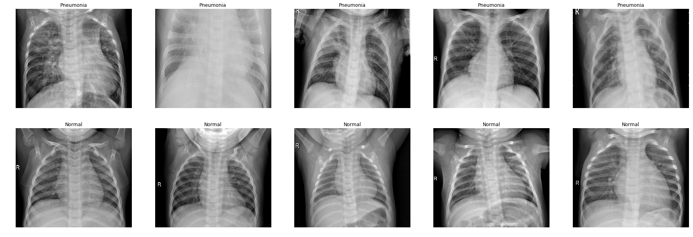

# Pneumonia Detection with Deep Learning
This project was completed for CS230: Deep Learning as taught by Stanford University. The goal was to diagnose pneumonia through the use of X-ray images, which were fed to a convolutional neural network.

The approach was to use a modified version of ResNet-50 (the only modification was to add Dropout layers for exploratory purposes). The dataset was taken from Kaggle [1].

Several ideas were explored in this project, including:
  * Dropout Layers
  * Learning Rate Decay
  * Transfer Learning
  * Regularization
  * Data Augmentation
  * Combining augmented and normal data generators
 
 The model was able to achieve over 96% accuracy, thus proving automated pneumonia detection through deep learning is efficient.

[1] https://www.kaggle.com/paultimothymooney/chest-xray-pneumonia
